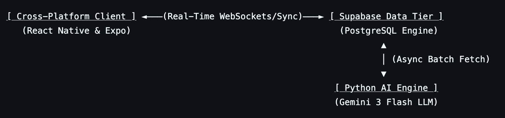

# ElevenOps

Cross platform mobile application desgined for the QMUL Football Team coaches. Previously named CoachAI

## 📌 Reason Behind This Project:

Managers frequently spend between 2 to 7+ hours per week handling purely administrative tasks—such as tracking RSVPs, managing squad availability, and chasing player feedback — before they even step onto the training pitch. 

The platform consolidates core logistics while also using generative ai (Gemini 3 Flash) to transform player wellness and performance questionnaires into clear, actionable tactical digests. 

## 🛠️ System Architecture & Data Flow:

ElevenOps is engineered as a three-tier, decoupled, real-time platform: 

## Core Features:

Role-Based Authentication & Guarded Onboarding : Utilises a backend PostgreSQL trigger within Supabase to catch raw user registrations and then automatically map them to the internal customised profiles schema, mitigating the risk of client-side network failures creating 'oprhan' accounts.

Streamlined Scheduling & Availability Analytics : Displays upcoming matches and training blocks dynamically sorted by date proximity. It also pulls status variables into a clean UI display so coaches can see real-time squad numbers before sessions begins.

Simplified Player Wellness & Feedback Inputs : Clear interface for logging physical preparedness, using sliders and text boxes.

AI-driven Questionnaire Analytics Pipeline : A python background pipeline is automated to run after a certain response count has be passed which 

